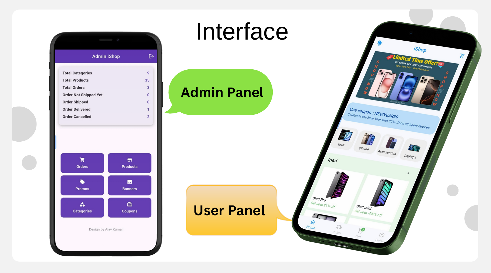

# 🛒 iShop – Full Stack E-Commerce Solution with Flutter & Firebase

**iShop** is an end-to-end e-commerce platform that consists of two primary panels:

1. **Admin Panel (`admin_iShop/`)**: This panel is designed for store administrators to manage inventory, promotions, orders, categories, and customers.
2. **User Panel (`iShop/`)**: This is the front-facing panel for users to browse products, manage their shopping cart, place orders, and track their order history.

Built using **Flutter** for a rich cross-platform experience, **Firebase** for the backend, and **Cloudinary** for media management, iShop is a fully-featured solution for both users and administrators to interact with an e-commerce platform seamlessly.


---

## 🛍️ Project Overview

iShop is designed to be a comprehensive e-commerce application with two distinct parts: **Admin Panel** and **User Panel**. These two parts operate independently, each with its own logic and responsibilities, but share the same backend services through **Firebase**.

### **Admin Panel (`admin_iShop/`)**
The **Admin Panel** is where the administrators manage the operations of the store, including products, categories, discounts, orders, and promotions. This panel provides a clean, responsive interface that allows admins to control the inventory, monitor user activity, and ensure smooth operations within the platform.

### **User Panel (`iShop/`)**
The **User Panel** is designed for consumers who want to browse products, add items to their shopping cart, apply discounts, and complete their purchases. This panel focuses on providing a seamless user experience with easy-to-navigate screens, responsive designs, and optimized workflows.

---

## ⚡ Features

### **Admin Panel (`admin_iShop/`)**
- **Admin Authentication**: Admin login and registration via Firebase Auth.
- **Dashboard**: Displays key store metrics such as total sales, number of orders, and active users.
- **Product Management**: Admins can add, update, or remove products from the store’s inventory.
- **Category Management**: Categorize products to make it easier for users to browse the store.
- **Coupon & Discount Management**: Create and manage discount codes for customers.
- **Order Management**: Track and manage customer orders, including order status and details.
- **Promo Banners**: Manage promotional banners and discounts, including media integration via Cloudinary.
- **Firebase Cloud Storage Integration**: Upload product images and promo banners directly to Firebase Storage or Cloudinary.

### **User Panel (`iShop/`)**
- **User Authentication**: Login and registration via Firebase Auth for users.
- **Product Browsing**: View products by category, apply filters, and search for products.
- **Shopping Cart**: Add items to the cart, adjust quantities, and view total price.
- **Checkout Process**: Review order details, apply discounts, and submit the order.
- **Order History**: View past orders with detailed information about each purchase.
- **Profile Management**: Users can view and update their profile details.
- **Discounts and Coupons**: Apply promo codes and coupons during checkout to avail discounts.
- **Responsive UI**: Optimized for both mobile and web platforms with a clean, user-friendly interface.

---

## 💻 Tech Stack

The **iShop** application is built using modern technologies that ensure performance, scalability, and ease of development.

### **Frontend**
- **Flutter**: The mobile app is developed using Flutter, a powerful framework for building native applications for iOS and Android from a single codebase.
- **Dart**: Flutter is powered by the Dart programming language, which is optimized for building fast, high-performance applications.
- **FlutterFire**: A set of Flutter plugins that enable easy integration with Firebase services, including authentication, cloud storage, Firestore, and more.

### **Backend**
- **Firebase**: Firebase is used for user authentication, database management (Firestore), and file storage (Firebase Cloud Storage).
  - **Firebase Authentication**: Handles login and signup processes for both admin and user panels.
  - **Firestore Database**: Stores data related to products, orders, users, and other essential entities.
  - **Firebase Storage**: Stores images for products and promotional banners.
- **Cloudinary**: For advanced image handling and management, particularly for product images and banners in the admin panel.

---

## 🗂️ Folder Structure

The project follows a clear and modular folder structure for maintainability and scalability. Each panel has a similar directory structure, which allows for easy navigation and understanding of the project's architecture.

### **Admin Panel (`admin_iShop/`)**

```
admin_iShop/
├── lib/
│   ├── constants/            # Defines global constants like discount values
│   ├── containers/           # Reusable UI components (buttons, banners, etc.)
│   ├── controllers/          # Handles logic for authentication, database operations, etc.
│   ├── models/               # Defines data models (product, order, category, etc.)
│   ├── providers/            # Manages state using the provider pattern
│   ├── views/                # UI screens (Dashboard, Product management, etc.)
│   ├── firebase_options.dart # Firebase configuration settings
│   └── main.dart             # Entry point for the Admin app
├── pubspec.yaml              # Dependencies and project configuration
```
### **User Panel (`iShop/`)**

```
iShop/
├── lib/
│   ├── containers/           # Reusable components like cart container, product list, etc.
│   ├── contacts/             # Logic for payment and discounts
│   ├── controllers/          # Authentication, database operations, etc.
│   ├── models/               # Defines data models for users, products, cart, etc.
│   ├── providers/            # Manages user and cart state
│   ├── views/                # UI screens for user interactions
│   ├── firebase_options.dart # Firebase configuration settings
│   └── main.dart             # Entry point for the User app
├── pubspec.yaml              # Dependencies and project configuration


```
---
## 🚀 Getting Started
### Prerequisites
- Before getting started, ensure that you have the following tools installed:
- Flutter SDK (version >= 3.29.1)
- Firebase Account with Firebase projects set up for both Admin and User panels
- Cloudinary Account (optional for Admin image management)
- Android Studio or Visual Studio Code for Flutter development

### Setting Up Firebase
1. **Create Firebase Projects**: Create two Firebase projects:
   - One for the Admin Panel
   - One for the User Panel
2. **Enable Firebase Authentication:** Enable Email/Password authentication for both projects in the Firebase console.
3. **Set Up Firestore:** Create collections in Firestore for products, orders, users, and categories.
4. **Enable Firebase Storage:** Set up Firebase Storage to handle product images and promotional banners.

### Install Dependencies
In each of the project directories (admin_iShop/ and iShop/), run the following command to fetch the required dependencies:

```
flutter pub get
```
### Run the Apps
Once the dependencies are installed, you can run the apps on an emulator or a physical device:

#### Admin Panel
```
cd admin_iShop
flutter run
```
#### User Panel
```
cd iShop
flutter run
```
## 📜 Project Details
### Admin Panel Structure
The Admin panel is designed for store administrators to manage various aspects of the platform. It includes several key screens:

- **Admin Dashboard:** Provides an overview of key metrics like total sales, total orders, etc.
- **Product Management:** Allows admins to add, update, or remove products from the inventory.
- **Order Management:** Track customer orders and update their statuses.
- **Promo Banners:** Admins can create and upload promotional banners using Cloudinary.
- **Category Management:** Categorize products for easier browsing.

### User Panel Structure
The User panel provides a seamless shopping experience for users. It includes:

- **Home Screen:** Displays featured products, promotions, and categories.
- **Product Detail:** Detailed product pages with images, prices, and descriptions.
- **Shopping Cart:** Users can add items to the cart, adjust quantities, and apply discounts.
- **Checkout Screen:** A smooth and secure process for placing an order.
- **Profile Management:** Users can update their personal information and view their order history.

## 🧪 Testing
Testing ensures that the application behaves as expected. Here's how you can get started with writing tests:

### Flutter Unit Tests
Flutter has built-in support for unit testing. To run tests:

```
flutter test
```
Ensure you write tests for the following areas:
- **User Authentication:** Test login, signup, and validation.
- **Product CRUD Operations:** Test creating, updating, and deleting products.
- **Cart Management:** Test adding/removing products to/from the cart.

### Integration Tests
For testing the overall flow, such as placing an order or managing products, use **integration tests** with **flutter_test** and **integration_test** packages.

## 🎯 Roadmap
Here’s what we plan to implement in future versions of iShop:

 - **Payment Integration** (Stripe, Razorpay)
 - **Advanced Admin Analytics** (Visual representation of sales, product performance)
 - **Wishlist:** Allow users to save products they like.
 - **Product Reviews & Ratings**
 - **Multi-language support**
 - **Push notifications for order updates**

## 💡Acknowledgements
- **Flutter:** A fantastic framework for building cross-platform apps.
- **Firebase:** A powerful backend-as-a-service for real-time databases, authentication, and cloud storage.
- **Cloudinary:** Excellent service for managing media in the cloud.

## 📝 License
This project is licensed under the MIT License - see the [LICENSE](https://github.com/codingAjayKumar/Ecommerce-Platform/blob/main/LICENSE) file for details.

## 👥 Authors & Contact
Built with ❤️ by **Ajay Kumar**

- **📫 Email:** [ajay kumar](ajaykumar3318586@gmail.com)
- **🐦 Twitter:** [AjayKumarHack](https://x.com/AjayKumarHack?t=JyvFBuDRIqaueTFsYj6KYw&s=09)
- **🌐 Linkedin:** [Ajay Software Engineer](https://www.linkedin.com/in/ajay-software-engineer/)
